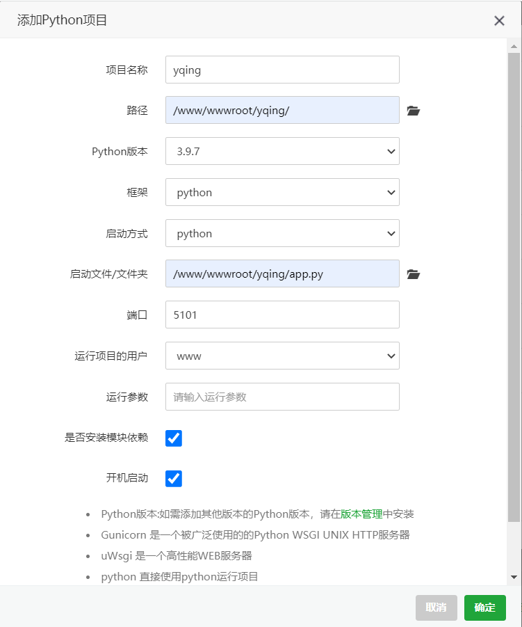

# 南科疫情自动打卡-观后无感

**南科疫情自动打卡web项目-观后无感**
****
# 说明

本程序为南京科技职业学院疫情自动打卡web
****
**项目框架：Flask**

创建你的数据库，库名为`yqing` 

配置根目录的`config.py`文件，修改数据库地址、数据表名、账号、密码

**配置完全部文件后**

1、在程序目录打开控制台执行

`pip install -r requirements.txt -i https://mirrors.aliyun.com/pypi/simple/`

等待模块安装完成即可，必须得安装指定版本的模块，不要安装最新版本的模块

2、在控制台执行命令`flask db init`进行数据库初始化，再执行`flask db migrate`构建数据库迁移文件，最后执行`flask db upgrade`上传已经创建的数据库表 
3、导入根目录的`yqing.sql`在你的数据库中 
4、在控制台输入命令`python app.py`运行疫情打卡web项目 

到这里本程序就已经安装并运行成功了

**如何在服务器上安装：**

在宝塔面板上安装`python项目管理器`

点击添加项目

python版本最好是3.9以上(如果没有请在管理器内下载python指定版本) 
跟我一样填写即可，如果项目启动有问题，请修改`运行项目的用户`为`root` 
第一个勾一定要打上，第二个看你需求
****
#**<<--管理员后台-->>**

域名地址/admin 
账号：123456 
密码：abcd 
改密码在数据库中直接改

# 目录介绍

`logs:日志存放文件夹`

`modile：核心程序存放文件夹`

`static：前端模板静态文件`

`task：定时任务核心文件`

`templates：前端模板存放文件夹`

`app.py：主程序`

`config.py：项目配置文件`

`exts.py：公共文件`

`log.py：日志程序`

# Falsk 框架的一些文档

**Falsk框架项目实战教程视频**

`【2023版-零基础玩转Python Flask框架-学完可就业】 https://www.bilibili.com/video/BV17r4y1y7jJ/?share_source=copy_web&vd_source=698b755e8ad6eb86b5516149dd3baaa6`

_定时任务_

`https://xugaoxiang.com/2020/10/08/flask-20-apscheduler/`
`https://blog.51cto.com/u_14246112/5158145`
`https://blog.csdn.net/RoninYang/article/details/121131548`

_数据库_

`
https://blog.csdn.net/lizhenqi123456/article/details/125442996
https://xugaoxiang.com/2020/10/08/flask-20-apscheduler/
https://www.cnblogs.com/yj0405/p/14824592.html#_label1
https://www.nuomiphp.com/eplan/192100.html
https://blog.csdn.net/Oopsl/article/details/105754689
`

_redis_

`
https://www.likeinlove.com/info/128.html
https://blog.csdn.net/craftsman2020/article/details/116115937
`

_模板_

`
https://blog.csdn.net/SincereQ/article/details/102823170
https://ajiho.gitee.io/bootstrap-admin/plugin-chart.html
https://www.bootcss.com/
https://www.jq22.com/
`

# 作者的话

**代码比较烂，大佬误笑**

